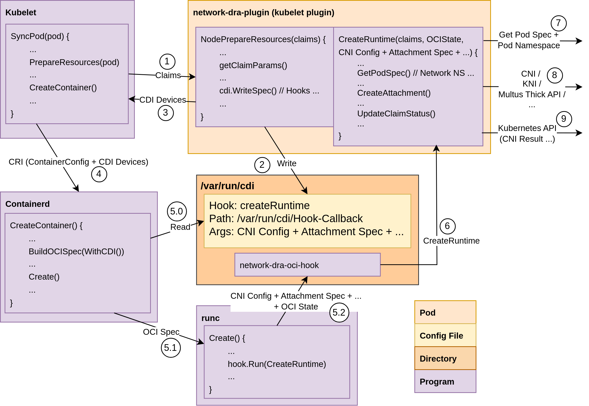

# Network DRA

Example of a DRA driver for call CNI on container creation.

## Demo

```
kind create cluster --config example/kind.yaml
```

```
helm install network-dra deployments/network-DRA
kubectl apply -f examples/pod.yaml
```

```
kubectl delete -f examples/pod.yaml ; helm delete network-dra
```

## Flow



## Resources

- DRA KEP: https://github.com/kubernetes/enhancements/blob/master/keps/sig-node/3063-dynamic-resource-allocation/README.md
- CDI: https://github.com/cncf-tags/container-device-interface
- DRA API: https://github.com/kubernetes/kubernetes/blob/v1.29.3/staging/src/k8s.io/kubelet/pkg/apis/dra/v1alpha3/api.proto#L34
- DRA Controller: https://pkg.go.dev/k8s.io/dynamic-resource-allocation/controller
- OCI Hooks: https://github.com/opencontainers/runtime-spec/blob/v1.2.0/runtime.md#lifecycle
- DRA Example: https://github.com/kubernetes-sigs/dra-example-driver
- DRA Presentation: https://kccnceu2023.sched.com/event/1HyWy/device-plugins-20-how-to-build-a-driver-for-dynamic-resource-allocation-kevin-klues-nvidia-alexey-fomenko-intel
- Network Device (Pod Resources?): https://github.com/opencontainers/runtime-spec/issues/1239
- Hot pluggable: https://github.com/cncf-tags/container-device-interface/issues/154
