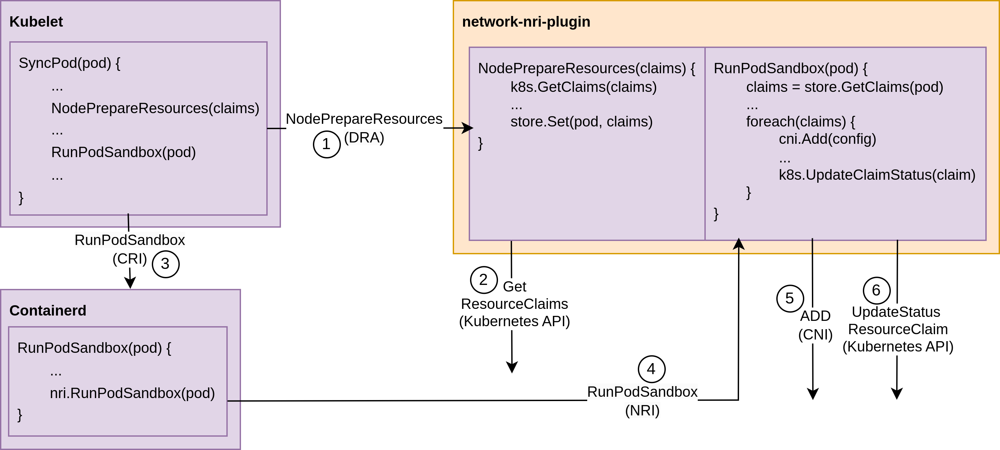

# Network DRA

Example of a DRA integration with an NRI Plugin for calling CNIs on pod creation.

This is a PoC (Proof Of Concept) about resource configuration. Kubernetes 1.31 (17d7d286201ae4b8e60014d8d0c41792d741d969) is used.

PoCs: 
* [v0.0.1 - DRA with CDI Calling CNI with hardcoded CNI specs](https://github.com/LionelJouin/network-dra/tree/v0.0.1)
* [v0.1.0 - DRA with CDI callling CNI with CRD exposing CNI specs](https://github.com/LionelJouin/network-dra/tree/v0.1.0)
    * [Slides](https://docs.google.com/presentation/d/1wxR6vAMK2Wl--ZqjnOZDJtvtJHtQe0_OEJH_h2lp2TI/edit?usp=sharing)
    * [Recording](https://www.youtube.com/watch?v=GdGtEW3ZGHk)
* [v0.1.1 - DRA with CDI callling CNI with CRD exposing CNI specs + default/primary network via DRA](https://github.com/LionelJouin/network-dra/tree/v0.1.1)
* [v0.2.0 - DRA with NRI callling CNI with CRD exposing CNI specs](https://github.com/LionelJouin/network-dra/tree/v0.2.0)
    * [Slides](https://docs.google.com/presentation/d/1CdIexp2Kaf38ktxd-kg5vE4RxjyOjSMzH-P8kUuOxCQ/edit?usp=sharing)
    * [Recording](https://www.youtube.com/watch?v=qNooLu7DWj4)
* Current - DRA (Kubernetes v1.31) with NRI callling CNI with CRD exposing CNI specs

## Build

Generate Code (Proto, API, ...)
```
make generate
```

build/push (default registry: localhost:5000/network-dra)
```
make REGISTRY=localhost:5000/network-dra
```

## Demo

Create Kind Cluster
```
kind create cluster --config examples/kind.yaml
```

Load Images in Kind
```
kind load docker-image localhost:5000/network-dra/network-dra-controller:latest
kind load docker-image localhost:5000/network-dra/network-nri-plugin:latest
```

Install CNI Plugins
```
kubectl apply -f https://raw.githubusercontent.com/k8snetworkplumbingwg/multus-cni/master/e2e/templates/cni-install.yml.j2
```

Install DRA Plugin
```
helm install network-dra deployments/network-DRA --set registry=localhost:5000/network-dra
```

Demo
```
kubectl apply -f examples/demo-a.yaml
# kubectl apply -f examples/demo-b.yaml
kubectl apply -f examples/demo-c.yaml
```

- Demo A
    - Single Pod with a single resource claim.
    - The pod will receive the interface described in the `macvlan-eth0-attachment` resource claim parameter.
- Demo B (Does no longer work as expected since ResourceClaim.Status.Shareable has been removed)
    - Single Pod with a single resource claim (Resource claim used in demo-a).
    - The pod will be in pending state since the resource claim is already in use (by demo-a).
- Demo C
    - Deployment uses a resource claim template.
    - 2 Pods will be running and new resource claims will be created for each of them.
    - The 2 pods will receive the interface described in the `macvlan-eth0-attach` resource claim template parameter.

## Flow



1. NRI Plugin registers itself as a plugin to the container runtime for RunPodSandbox events.
2. Kubelet creates the pod.
    * Kubelet does not call the DRA Driver (kubelet plugin) as there is no container claiming the resource.
    * Kubelet calls RunPodSanbox to the Container runtime.
3. At the end of RunPodSanbox, the container runtime calls RunPodSanbox([nri.PodSandbox](https://github.com/containerd/nri/blob/v0.6.1/pkg/api/api.proto#L213)) for each NRI Plugin.
    * The pod Name, pod Namespace, network namespace are retrived.
4. The claims must be retrieved as there are not part of the parameters. Kubernetes API is then called to get all resource claims with the pod in the status.ReservedFor.
5. The NRI plugin creates the network attachment based on the parameters it received. This can be done using CNI or anything else.
6. TODO: Expose the status of the attachment.

## Conclusion

- Is this a proper way to have pod-level resources?
    * The documentation only mentions kubelet plugins (e.g. [ResourceHandles](https://github.com/kubernetes/api/blob/v0.31.0-alpha.0/resource/v1alpha2/types.go#L149)).
    * DriverName is not really used as there is no kubelet plugin / DRA plugin.
    * No kubelet plugin is called as no container is claiming the resources. The resources are only stated on the pod level.
- How to report the network interface status?
    1. Could be set by the DRA Controller (not part of this PoC)
        * IPAM/MAC/... to be configured during scheduling.
        * No more IPAM CNI (IPs would be static).
    2. Resource claim status cannot be set during configuration.
- How to handle the default Pod Network?
    1. [Disable CNI as in the previous PoC](https://github.com/LionelJouin/network-dra/tree/v0.1.1?tab=readme-ov-file#default-network)
    2. [Use a Dummy CNI and configure the default network in the DRA way?](https://kubernetes.slack.com/archives/C03UT5H9KDZ/p1716482763774609?thread_ts=1713165700.322819&cid=C03UT5H9KDZ)
        * How to report PodIPs from NRI?
- Lifecycle
    * NRI plugin can listen on RemovePodSandbox, so CNI DEL could be done.
    * If NRI plugin is no longer registered. A pod can be created without receiving its requested configuration.
    * What about CNI CHECK?
    * Could CNI STATUS be done in the DRA Controller?

## Resources

- MN KEP: https://github.com/kubernetes/enhancements/pull/3700
- MN Sync: https://docs.google.com/document/d/1pe_0aOsI35BEsQJ-FhFH9Z_pWQcU2uqwAnOx2NIx6OY/edit#heading=h.fo1yo94x96wg
- DRA KEP: https://github.com/kubernetes/enhancements/blob/master/keps/sig-node/3063-dynamic-resource-allocation/README.md
- DRA API: https://github.com/kubernetes/kubernetes/blob/v1.30.0/staging/src/k8s.io/kubelet/pkg/apis/dra/v1alpha3/api.proto#L34
- DRA Controller: https://pkg.go.dev/k8s.io/dynamic-resource-allocation/controller
- NRI: https://github.com/containerd/nri
- NRI in Containerd: https://github.com/containerd/containerd/blob/v2.0.0-rc.2/docs/NRI.md
- Network Device Injector NRI Plugin PR: https://github.com/containerd/nri/pull/82
- NRI Network PR: https://github.com/containerd/nri/pull/57
